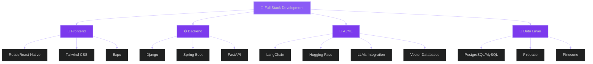

<div align="center">
  
#  Hey there, I'm Lean Kurt Escano

### 🚀 Building AI-powered experiences across web and mobile


[](https://linkedin.com/in/LeanKurtEscano)
[](https://github.com/LeanKurtEscano)
[](mailto:leankurtescano@gmail.com)


</div>

---

## 🌌 About Me

🎓 **BSIT – System Development** student at **Laguna University**  
📍 **Santa Maria, Laguna, Philippines** 🇵🇭  

I am a **software developer** focused on building **scalable, maintainable, and real-world applications** across web and mobile platforms. My strength lies in **full-stack development**, where I design clean user interfaces, implement robust backend systems, and work with databases and APIs end-to-end.

I enjoy transforming complex requirements into **well-structured software systems**, applying solid **software engineering principles**, and writing code that is clean, readable, and production-ready. I also integrate **AI features** into applications to improve automation, data insights, and user experience.

### 🔧 What I Focus On
- 🧱 Designing **modular and scalable architectures**
- ⚙️ Building **API-driven backend systems**
- 🧠 Applying **problem-solving and system thinking**
- 🔐 Implementing **authentication, validation, and security**
- ♻️ Writing maintainable code with refactoring in mind
- 🚀 Continuously learning through projects and experimentation

⚡ *Fun fact:* I enjoy optimizing and refactoring code just as much as building features ☕💻

---

## 🧩 Skills & Technologies

### 🧑‍💻 Software Development
- Object-Oriented Programming (OOP)
- Modular & scalable application design
- RESTful API development
- Authentication & Authorization (JWT, OAuth)
- MVC & layered architecture
- Version control with Git & GitHub
- Debugging, refactoring, and clean code practices

### 🌐 Full-Stack Web Development

**Frontend**
- React & TypeScript (Vite)
- Tailwind CSS (responsive & utility-first UI)
- State management (Zustand, Context API)
- Data fetching & caching (TanStack Query)
- UI/UX implementation from design to code

**Backend**
- Django & Django REST Framework
- FastAPI (high-performance APIs)
- Spring Boot (Java backend services)
- API validation, middleware, and error handling
- Async processing & background tasks

### 🗄️ Databases & Data Management
- PostgreSQL & MySQL
- Database schema design & normalization
- Optimized SQL queries
- ORM usage (Django ORM, SQLAlchemy)
- Migrations & data integrity constraints
- Serverless databases (Neon)

### 🤖 AI Integration (Applied)
- LLM integration (GPT, Claude, Gemini)
- LangChain for AI workflows
- Retrieval-Augmented Generation (RAG)
- Vector databases (Pinecone)
- AI-assisted data analysis & automation

### 🛠️ Tools & Engineering Practices
- Docker (containerized development)
- Postman & API testing
- Environment & secrets management
- Deployment with Netlify & Render
- CI-friendly project structuring

---

> 🎯 **Goal:** Grow as a well-rounded **software engineer** with strong backend foundations, full-stack expertise, and practical AI integration.
<br clear="right"/>
---

## 🛠️ Tech Stack

### 💻 **Programming Languages**


### 🌐 **Frontend Development**


### ⚙️ **Backend Development**


### 🤖 **AI & Machine Learning**


### 🗄️ **Databases**


### 🧰 **Tools & Platforms**


---

## 🌠 Tech Universe

<div align="center">

### 🪐 My Technology Ecosystem

<table>
<tr>
<td width="50%" valign="top">

#### 🎨 Frontend Galaxy
```yaml
🌟 Core: React & React Native
🎭 Styling: Tailwind CSS
📱 Mobile: Expo
🎪 State: Zustand & Context API
🔄 Data Fetching: TanStack Query
✨ Animations: Framer Motion
```

#### ⚙️ Backend Constellation
```yaml
🐍 Python: Django & FastAPI
☕ Java: Spring Boot
🔐 Auth: JWT & OAuth
📡 APIs: RESTful & GraphQL
🔄 Real-time: WebSockets
```

</td>
<td width="50%" valign="top">

#### 🤖 AI/ML Nebula
```yaml
🧠 Frameworks: LangChain
🤗 Models: Hugging Face & Ollama
💬 LLMs: GPT, Claude, Gemini
🎯 Vector DB: Pinecone
🔍 RAG: Retrieval Systems
```

#### 💾 Data Cosmos
```yaml
🐘 PostgreSQL: Primary DB
🐬 MySQL: Legacy Support
🔥 Firebase: Real-time Data
⚡ Neon: Serverless Postgres
🗃️ Vector: Pinecone
```

</td>
</tr>
</table>


### 🔮 Tech Stack Visualization



</div>

---

## 🚀 Featured Projects

<div align="center">

### 🌟 Project Highlights Coming Soon 🌟

*Building something amazing? Stay tuned!*

</div>

<!-- 
Example project card structure:

### 🎯 [Project Name](project-link)
**Tech Stack:** React, Django, PostgreSQL, LangChain  
Brief description of what the project does and the problem it solves. Highlight AI integration or unique features.

[](repo-link)
[](demo-link)
-->

---

## 📊 GitHub Analytics

<div align="center">

<br>

<a href="https://github.com/LeanKurtEscano">
  
  
</a>

<br>


<br>


<br>


</div>

---
---

## 📫 Let's Connect

<div align="center">


<br><br>

💼 Open to **collaborations**, **internships**, and **freelance opportunities**  
🌟 Let's build something **extraordinary** together!

<br>

[](https://linkedin.com/in/LeanKurtEscano)
[](mailto:leankurtescano@gmail.com)
[](https://github.com/LeanKurtEscano)
[](https://twitter.com/LeanKurtEscano)


</div>

---

<div align="center">


### 💭 *"The only way to do great work is to love what you do."* — Steve Jobs

<br>


<br>


⭐️ From [LeanKurtEscano](https://github.com/LeanKurtEscano) with 💜


</div>
