# Hey there, I'm Lean Kurt Escano

### 🚀 Full-Stack Developer | AI Integration Specialist | System Development Student

  

---

## 👨‍💻 About Me

🎓 **BSIT - System Development** student at **Laguna University**  
📍 Based in **Santa Maria, Laguna, Philippines** 🇵🇭

I'm a full-stack developer passionate about crafting **intelligent**, **scalable**, and **user-centric applications**. My expertise lies in building end-to-end solutions that seamlessly integrate modern web technologies with AI capabilities. From designing responsive interfaces to architecting robust backend systems, I thrive on turning complex problems into elegant solutions.

**What drives me:**
- 🏗️ Architecting full-stack applications with clean, maintainable code
- 🤖 Integrating AI/ML capabilities into production-ready systems
- 🎯 Solving real-world problems through thoughtful software design
- 📚 Continuously expanding my technical knowledge and staying current with industry trends
- 🌐 Building scalable, performant applications that deliver exceptional user experiences

⚡ **Philosophy:** I believe great software is built at the intersection of solid engineering principles, user empathy, and innovative thinking.

---

## 💼 Core Competencies

### 🎯 Full-Stack Development
Building complete web and mobile applications from concept to deployment, with expertise in both client and server-side technologies. Experienced in RESTful API design, state management, authentication systems, and creating seamless user experiences across platforms.

### 🤖 AI Integration
Specializing in incorporating AI capabilities into practical applications using LangChain, vector databases, and various LLM APIs. Skilled in building RAG systems, chatbots, and intelligent features that enhance user interactions.

### 📱 Cross-Platform Development
Creating native-quality mobile applications using React Native and Expo, ensuring consistent experiences across iOS and Android platforms while maintaining a single codebase.

### 🏗️ System Architecture
Designing scalable, maintainable system architectures with proper separation of concerns, efficient data flow, and consideration for future growth and feature expansion.

---

## 🛠️ Technical Skills

### **Frontend Development**

**Expertise:** Component architecture, state management (Zustand, Context API), responsive design, mobile-first development, TanStack Query for server state, hooks optimization, and performance tuning.

---

### **Backend Development**

**Expertise:** RESTful API design, authentication & authorization (JWT, OAuth), ORM (Django ORM, JPA), middleware development, request validation, error handling, and microservices architecture.

---

### **Database Management**

**Expertise:** Database design & normalization, complex queries & optimization, indexing strategies, transaction management, data modeling, migrations, and working with both relational and NoSQL databases.

---

### **AI & Machine Learning**

**Expertise:** LLM integration, RAG (Retrieval-Augmented Generation) systems, vector databases, prompt engineering, embedding models, AI-powered features, and building intelligent chatbots and assistants.

---

### **DevOps & Tools**

**Expertise:** Version control workflows, containerization, CI/CD pipelines, API testing, cloud deployment, environment management, and collaborative development practices.

---

## 🔮 Technical Architecture

```mermaid
%%{init: {'theme':'dark', 'themeVariables': { 'primaryColor':'#8B5CF6', 'primaryTextColor':'#fff', 'primaryBorderColor':'#A78BFA', 'lineColor':'#C4B5FD', 'secondaryColor':'#7C3AED', 'tertiaryColor':'#6D28D9'}}}%%
graph TB
    A[💻 Software Development] --> B[🎨 Frontend Layer]
    A --> C[⚙️ Backend Layer]
    A --> D[💾 Data Layer]
    A --> E[🤖 AI/ML Layer]
    
    B --> B1[React Ecosystem]
    B --> B2[Mobile Development]
    B --> B3[UI/UX Design]
    
    C --> C1[API Development]
    C --> C2[Business Logic]
    C --> C3[Authentication]
    
    D --> D1[Database Design]
    D --> D2[Data Modeling]
    D --> D3[Query Optimization]
    
    E --> E1[LLM Integration]
    E --> E2[Vector Search]
    E --> E3[Intelligent Features]
    
    style A fill:#8B5CF6,stroke:#A78BFA,stroke-width:3px
    style B fill:#7C3AED,stroke:#A78BFA
    style C fill:#7C3AED,stroke:#A78BFA
    style D fill:#7C3AED,stroke:#A78BFA
    style E fill:#7C3AED,stroke:#A78BFA
```

---

## 📊 GitHub Analytics

  

  

  

---

## 📫 Let's Connect

💼 Open to **collaborations**, **internships**, and **freelance opportunities**  
🌟 Interested in discussing software architecture, AI integration, or potential projects

---

### 💭 *"Code is like humor. When you have to explain it, it's bad."* — Cory House

⭐️ From [LeanKurtEscano](https://github.com/LeanKurtEscano) with 💜
