<div align="center">
  
# 👋 Hey there, I'm [Your Name]

### 🚀 Building AI-powered experiences across web and mobile


[](your-linkedin-url)
[](your-github-url)
[](mailto:your-email)

</div>

---

## 🌌 About Me

```typescript
const developer = {
  name: "Your Name",
  education: "BSIT - System Development @ Laguna University",
  location: "Calamba, Laguna, Philippines 🇵🇭",
  passion: [
    "Building intelligent applications",
    "Integrating AI into real-world solutions",
    "Creating seamless full-stack experiences"
  ],
  currentFocus: "AI-powered web & mobile development",
  funFact: "I turn coffee into code and ideas into reality ☕💻"
};
```

🎓 **Student Developer** passionate about creating **data-driven**, **intelligent**, and **full-stack applications**  
🔭 Currently exploring the intersection of **AI** and **modern web technologies**  
💡 Love integrating **LLMs** and **machine learning** into practical solutions  
🌱 Always learning, always building

---

## 🛠️ Tech Stack

### 💻 **Programming Languages**


### 🌐 **Frontend Development**


### ⚙️ **Backend Development**


### 🤖 **AI & Machine Learning**


### 🗄️ **Databases**


### 🧰 **Tools & Platforms**


---

## 🌠 Tech Universe

```mermaid
mindmap
  root((🚀 My Tech Stack))
    🎨 Frontend
      React
      React Native
      Tailwind CSS
    ⚡ Backend
      Django
      Spring Boot
      FastAPI
    🤖 AI/ML
      LangChain
      Hugging Face
      Ollama
      LLMs
    💾 Data
      PostgreSQL
      MySQL
      Firebase
      Pinecone
    🛠️ DevOps
      Git
      Docker
      Netlify
      Render
```

<div align="center">



</div>

---

## 🚀 Featured Projects

<div align="center">

### 🌟 Project Highlights Coming Soon 🌟

*Building something amazing? Stay tuned!*

</div>

<!-- 
Example project card structure:

### 🎯 [Project Name](project-link)
**Tech Stack:** React, Django, PostgreSQL, LangChain  
Brief description of what the project does and the problem it solves. Highlight AI integration or unique features.

[](repo-link)
[](demo-link)
-->

---

## 📊 GitHub Stats

<div align="center">


</div>

---

## 📫 Let's Connect

<div align="center">

💼 Open to **collaborations**, **internships**, and **freelance opportunities**  
🌟 Let's build something **extraordinary** together!

[](your-linkedin-url)
[](mailto:your-email)
[](your-portfolio-url)

</div>

---

<div align="center">

### 💭 *"The only way to do great work is to love what you do."* — Steve Jobs


⭐️ From [your-username](https://github.com/your-username)

</div>
