<div align="center">
  
#  Hey there, I'm Lean Kurt Escano

### 🚀 Building AI-powered experiences across web and mobile


[](https://linkedin.com/in/LeanKurtEscano)
[](https://github.com/LeanKurtEscano)
[](mailto:leankurtescano@gmail.com)


</div>

---

## 🌌 About Me


🎓 **BSIT - System Development** student at **Laguna University**  
📍 Based in **Calamba, Laguna, Philippines** 🇵🇭  
💡 Passionate about building **intelligent**, **data-driven**, and **full-stack applications**  
🤖 Specialized in **integrating AI** into real-world web and mobile solutions  
🔭 Currently exploring the intersection of **LLMs** and **modern web technologies**  
🌱 Always learning, experimenting, and pushing boundaries  
⚡ Fun fact: I turn **coffee into code** and **ideas into reality** ☕💻  

**What I'm up to:**
- 🚀 Building AI-powered applications that solve real problems
- 🧠 Experimenting with LangChain, vector databases, and RAG systems
- 📱 Creating seamless mobile experiences with React Native
- 🎯 Contributing to open-source and learning every day

<br clear="right"/>


---

## 🛠️ Tech Stack


### 💻 **Programming Languages**


### 🌐 **Frontend Development**


### ⚙️ **Backend Development**


### 🤖 **AI & Machine Learning**


### 🗄️ **Databases**


### 🧰 **Tools & Platforms**


---

## 🌠 Tech Universe

<div align="center">

### 🪐 My Technology Ecosystem

<table>
<tr>
<td width="50%" valign="top">

#### 🎨 Frontend Galaxy
```yaml
🌟 Core: React & React Native
🎭 Styling: Tailwind CSS
📱 Mobile: Expo
🎪 State: Redux & Context API
✨ Animations: Framer Motion
```

#### ⚙️ Backend Constellation
```yaml
🐍 Python: Django & FastAPI
☕ Java: Spring Boot
🔐 Auth: JWT & OAuth
📡 APIs: RESTful & GraphQL
🔄 Real-time: WebSockets
```

</td>
<td width="50%" valign="top">

#### 🤖 AI/ML Nebula
```yaml
🧠 Frameworks: LangChain
🤗 Models: Hugging Face & Ollama
💬 LLMs: GPT, Claude, Gemini
🎯 Vector DB: Pinecone
🔍 RAG: Retrieval Systems
```

#### 💾 Data Cosmos
```yaml
🐘 PostgreSQL: Primary DB
🐬 MySQL: Legacy Support
🔥 Firebase: Real-time Data
⚡ Neon: Serverless Postgres
🗃️ Vector: Pinecone
```

</td>
</tr>
</table>


### 🔮 Tech Stack Visualization

```mermaid
%%{init: {'theme':'dark', 'themeVariables': { 'primaryColor':'#8B5CF6', 'primaryTextColor':'#fff', 'primaryBorderColor':'#A78BFA', 'lineColor':'#C4B5FD', 'secondaryColor':'#7C3AED', 'tertiaryColor':'#6D28D9'}}}%%
graph TB
    A[🚀 Full Stack Development] --> B[🎨 Frontend]
    A --> C[⚙️ Backend]
    A --> D[🤖 AI/ML]
    A --> E[💾 Data Layer]
    
    B --> B1[React/React Native]
    B --> B2[Tailwind CSS]
    B --> B3[Expo]
    
    C --> C1[Django]
    C --> C2[Spring Boot]
    C --> C3[FastAPI]
    
    D --> D1[LangChain]
    D --> D2[Hugging Face]
    D --> D3[LLMs Integration]
    D --> D4[Vector Databases]
    
    E --> E1[PostgreSQL/MySQL]
    E --> E2[Firebase]
    E --> E3[Pinecone]
    
    style A fill:#8B5CF6,stroke:#A78BFA,stroke-width:3px
    style B fill:#7C3AED,stroke:#A78BFA
    style C fill:#7C3AED,stroke:#A78BFA
    style D fill:#7C3AED,stroke:#A78BFA
    style E fill:#7C3AED,stroke:#A78BFA
```




</div>

---

## 🚀 Featured Projects

<div align="center">

### 🌟 Project Highlights Coming Soon 🌟

*Building something amazing? Stay tuned!*


</div>

<!-- 
Example project card structure:

### 🎯 [Project Name](project-link)
**Tech Stack:** React, Django, PostgreSQL, LangChain  
Brief description of what the project does and the problem it solves. Highlight AI integration or unique features.

[](repo-link)
[](demo-link)
-->

---

## 📊 GitHub Analytics

<div align="center">

<br><br>

<a href="https://github.com/LeanKurtEscano">
  
  
</a>

<br>


<br>


<br>


<br>

</div>


## 📫 Let's Connect

<div align="center">


<br><br>

💼 Open to **collaborations**, **internships**, and **freelance opportunities**  
🌟 Let's build something **extraordinary** together!

<br>

[](https://linkedin.com/in/LeanKurtEscano)
[](mailto:leankurtescano@gmail.com)
[](https://github.com/LeanKurtEscano)
[](https://twitter.com/LeanKurtEscano)


</div>

---

<div align="center">


### 💭 *"The only way to do great work is to love what you do."* — Steve Jobs

<br>


<br>


⭐️ From [LeanKurtEscano](https://github.com/LeanKurtEscano) with 💜


</div>
